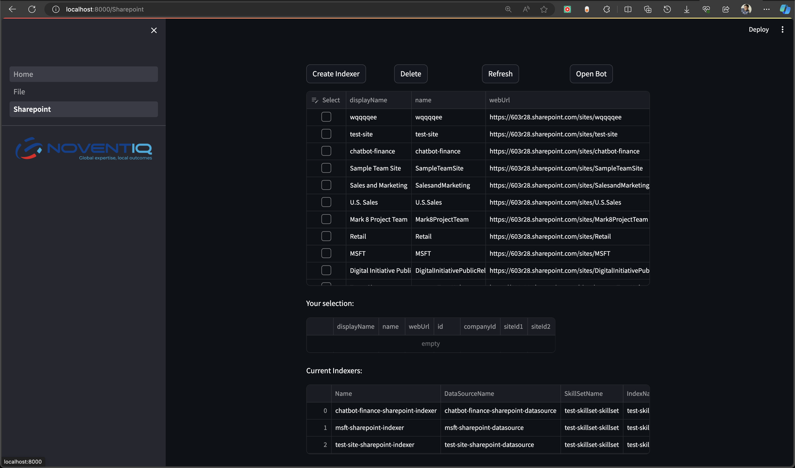
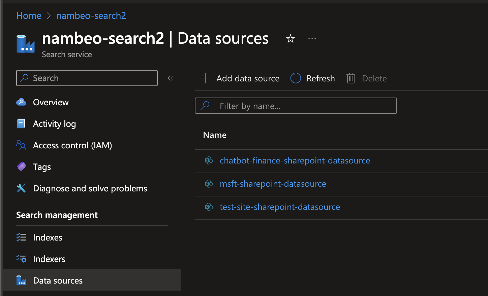
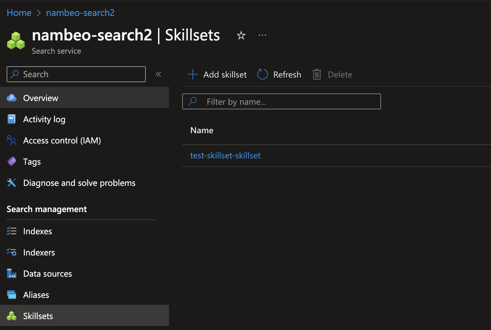
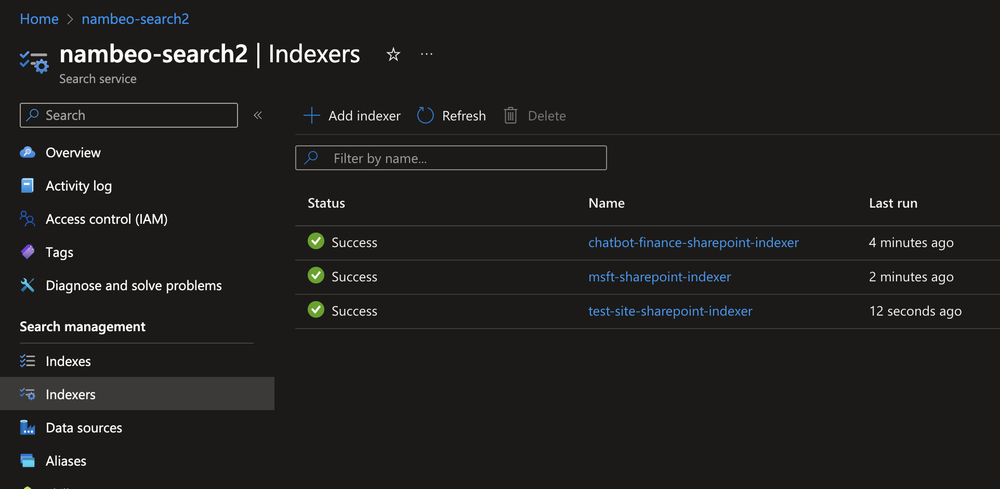
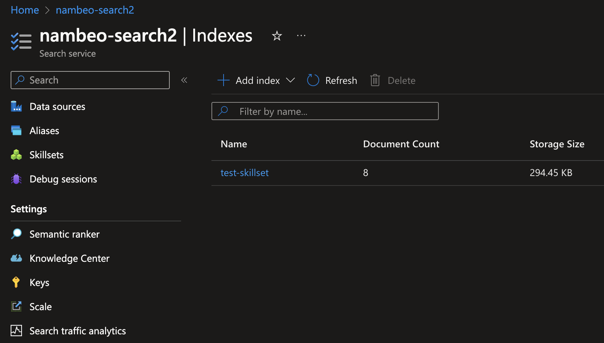
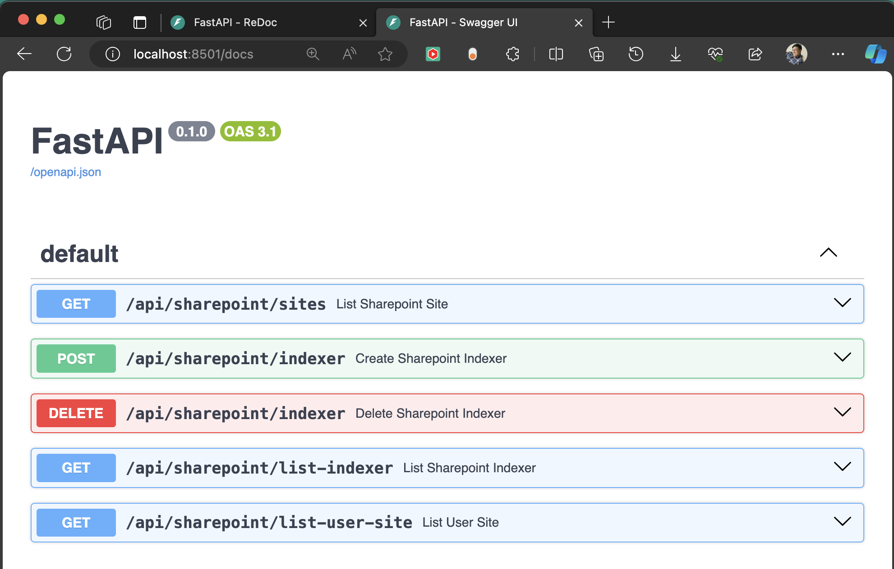
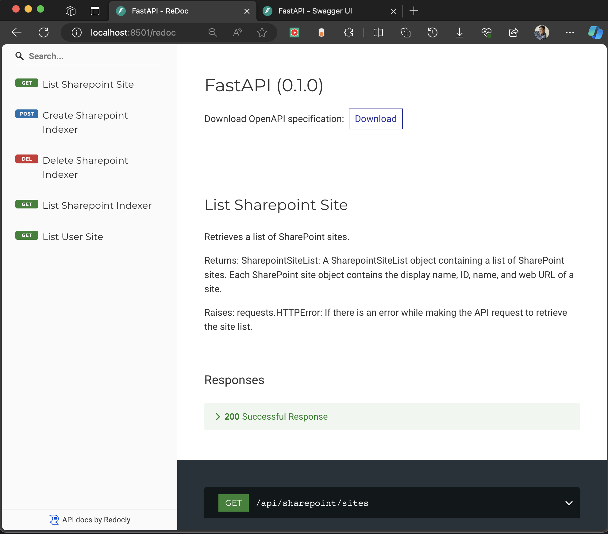
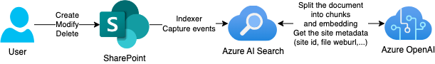
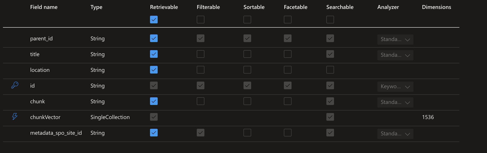
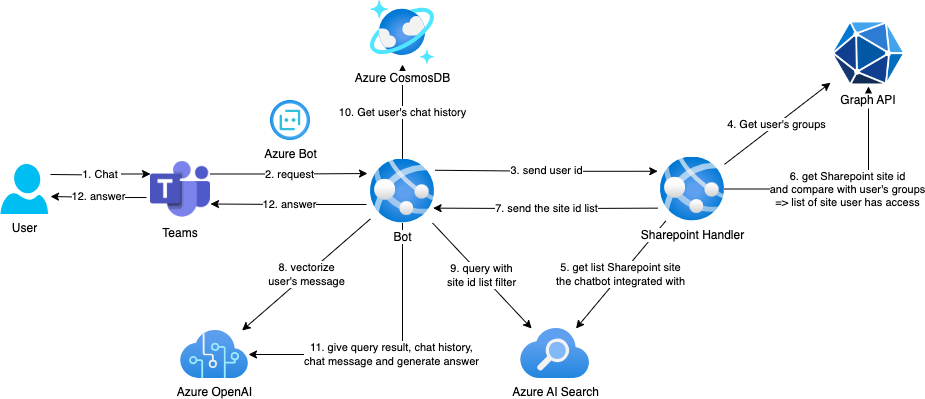

# nvt-openai-sharepoint-handler
Easily integrate Azure AI Search with your Sharepoint sites with just a few clicks.

## Prerequisites:

- Python >= 3.11.6
- Office 365 tenant
- On Azure subscriptions create these resources:
    - [Azure OpenAI](https://learn.microsoft.com/en-us/azure/ai-services/openai/how-to/create-resource?pivots=web-portal)
    - [Azure AI Search](https://learn.microsoft.com/en-us/azure/search/search-create-service-portal)
    - [Azure Bot Service](https://learn.microsoft.com/en-us/azure/bot-service/abs-quickstart?view=azure-bot-service-4.0&tabs=userassigned)
    - [A service princpal](https://learn.microsoft.com/en-us/entra/identity-platform/app-objects-and-service-principals?tabs=browser) with following permissions:
        - Graph API permission:
            - "Directory.Read.All"
            - "Files.Read.All"
            - "Sites.Read.All"
            - "Team.ReadBasic.All"
            - "User.Read.All

### To run locally
1. Install required dependencies
```
pip install -r ./requirements.txt
```
2. Create a `.env` file from `.env-template` and fill in informations

    **Azure AI Search config**
    ```
    AZURE_SEARCH_ENDPOINT=
    AZURE_SEARCH_INDEX=
    ```

    **Azure openai config**
    ```
    AZURE_OPENAI_ENDPOINT=
    AZURE_OPENAI_KEY=
    AZURE_OPENAI_CHAT_MODEL=gpt-35-turbo-16k
    AZURE_OPENAI_CHAT_DEPLOYMENT=
    AZURE_OPENAI_EMBED_MODEL=text-embedding-ada-002
    AZURE_OPENAI_EMBED_DEPLOYMENT=
    ```

    **endpoint config**
    ```
    BACKEND_URL=http://127.0.0.1:8501
    TEAMS_BOT_URL=
    ```

    **Sharepoint config**
    ```
    SHAREPOINT_CLIENT_ID=
    SHAREPOINT_CLIENT_SECRET=
    SHAREPOINT_TENANT_ID=
    SHAREPOINT_DOMAIN=
    ```
3. run these 2 commands to start the backend and frontend:

**Backend**
```
uvicorn main:app --reload --port 8501
```

**Frontend**
```
streamlit run Home.py --server.port 8000
```

Done!, you can access the frontend via http://localhost:8000

## How-to

Inside the sidebar *(on the left)*, you can integrate this tool to **Sharepoint site** by choosing `Sharepoint` or **Azure Blob Storage** by choosing `File` *(this is under experiment so expect for bugs)*

Inside the `Sharepoint` panel there will be 4 buttons: `Create indexer`, `Delete`, `Refresh`, `Open Bot`

### Integrate with Sharepoint site
1. if configured properly - the first table should shows all Sharepoint sites inside your current tenant
2. Inside the first table choose Sharepoint site that you wish to integrate the tool with and click `Create indexer`:
    - In **Azure AI Search**:
        - A Sharepoint datasource will be created
        
        - A skillset with: **SplitSkill** and **EmbeddingSkill** will be created
        
        - An Indexer that use the Sharepoint datasource and the skillset
        
        - An index
        

That's it, you are good to go.

### Working with API
For the API documentations, I develop this using FastAPI - so by default it already has **Swagger** and **ReDoc** [read more here](https://fastapi.tiangolo.com/tutorial/.metadata/).

You can check by accessing via http://localhost:8501/docs or http://localhost:8501/redoc

> Swagger

> Redoc


## A Few words on why this was created
We do this as a POC for **document level security** with user reside in a tenant or multitenancy, when chat with OpenAI chatbot via Teams *(we use Bot Framework SDK)* the chatbot will only answer based on documents that user has access to.

So technically, the issue here is how the Azure AI Search filter the result based on user's access.


## How we solve the filter issue

Indexing Sharepoint sites document with **Azure AI Search** features:
- **[Indexer](https://learn.microsoft.com/en-us/azure/search/search-indexer-overview)**: is a crawler that extracts textual data from cloud data sources and populates a search index using field-to-field mappings between source data and a search index.

With Indexer we can extract metadata of the document in Sharepoint site such as: filename (`metadata_spo_item_name`), the Sharepoint site ID (`metadata_spo_site_id`), the weburl of the document (`metadata_spo_item_weburi`),... **[read more at here](https://learn.microsoft.com/en-us/azure/search/search-howto-index-sharepoint-online)**

- **[Skillset](https://learn.microsoft.com/en-us/azure/search/cognitive-search-working-with-skillsets)**: A skillset is a reusable resource in Azure AI Search that's attached to an indexer. It contains one or more skills that call built-in AI or external custom processing over documents retrieved from an external data source.

Utilizing **[Split skill](https://learn.microsoft.com/en-us/azure/search/cognitive-search-skill-textsplit)** to split documents into smaller chunks that fit the token input of GPT model and **[Embedding skill](https://learn.microsoft.com/en-us/azure/search/cognitive-search-skill-textsplit)** to vectorize the content of chunk. We put those into the index, detailed of the field we project into the index is:

| Original Field | Projected Field |
| ------------- | ------------- |
| metadata_spo_item_name | title |
| metadata_spo_item_weburi | location |
| content | chunk |
| vector | chunkVector |
| metadata_spo_site_id | metadata_spo_site_id |



So with this, we indexed Sharepoint documents and know which document belong to which site based on `metadata_spo_site_id`. *now the next step is how to know if the user has access to which site?*


## How to know if the user has access to which site
As I mentioned before: 
> **OpenAI chatbot via Teams *(we use Bot Framework SDK)***

We use **[Bot Framework SDK](https://learn.microsoft.com/en-us/azure/bot-service/bot-service-overview?view=azure-bot-service-4.0)** to establish the Teams channel that user can interact with the bot.
When using Teams, you must logged in a Microsoft account and that account belong to a tenant. 

Sharepoint Online site in Azure AD has its own group and in the `proxyAddresses` attribute has the ID of `metadata_spo_site_id` in it. 

If the user has access to the Sharepoint site then they will also in that Azure AD group. And by looking up if the group has `metadata_spo_site_id` inside `proxyAddresses`, we have a list of site ID that user has access to.

By using Azure Graph API we can get these information and based on Sharepoint groups we filter `metadata_spo_site_id`


*Note: this repository only has the **Sharepoint Handler** the **Bot** componnet is private :D*


## License
[MIT](https://choosealicense.com/licenses/mit/)